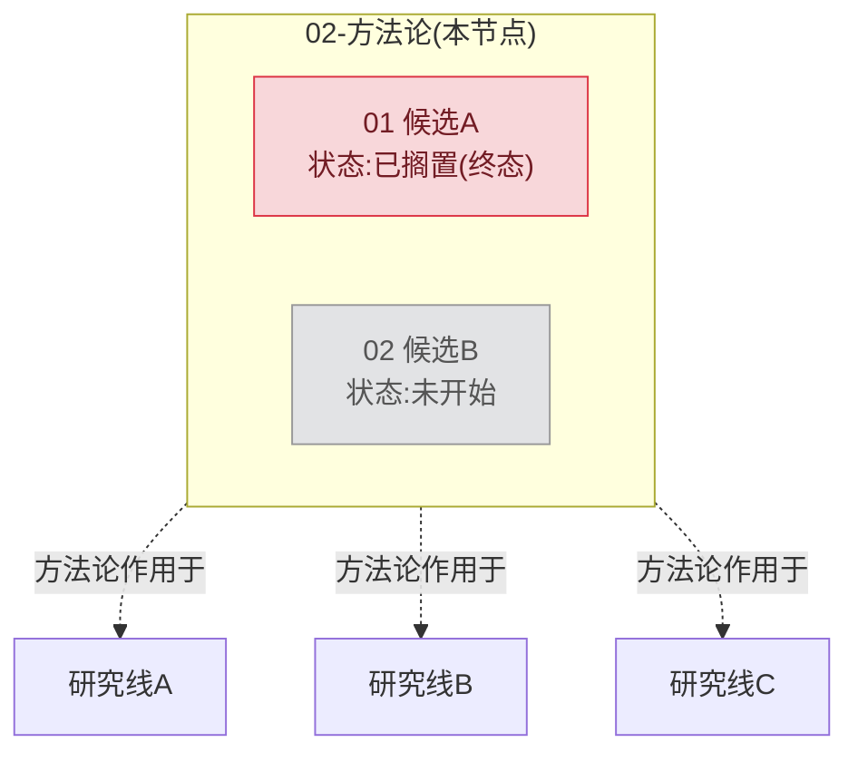

# Task Tree:参考资料

本文档不引入新规则,规则以 `SKILL.md` 为准。这里记录每条规则的推导过程、
真实反例,以及一个完整的 worked example。素材改编自一次真实项目的任务重组
讨论,已抽象掉具体项目细节,只保留有参考价值的结构。

## 为什么"横向扇出大就该拆"这条判据不够,要分宽/深两种

早期版本的判据只看"扇出面大不大"。但真实项目里出现过两个方向相反的反例:

- 一条研究线下面有 10 个平行的候选方案,扇出很宽,但**从未拆成 10 个文件夹**
  ——全部是同一份实施计划里的章节,而且读起来比拆开更好用(一份文档能横向
  对比 10 个方案,拆成 10 个文件夹要开 10 次)。
- 另一条研究线的扇出并不宽(就几个直接产出),但其中一项跨了好几周、好几轮
  推进,有自己独立的原始数据和结论文档——这项**确实**被拆成了独立文件夹
  体系,而且拆了之后明显更好维护。

结论:扇出宽/窄和"该不该拆"不是一回事。宽是**横向症状**(很多平级的轻量项),
处方是表格折叠,不动文件夹结构;真正决定要不要拆文件夹的是**纵向信号**——
这个节点本身要不要跨会话持续推进、要不要自己的证据链。`SKILL.md` 里"什么
时候该扇出"这节把这两条都列了,不是只看数字。

## 为什么"同一层级不要求整齐划一"

如果强制"一个节点升级了,同层所有节点都要跟着升级",会导致给根本不需要独立
追溯的简单步骤编造背景/目标去凑格式——那个背景是编的,不是真有必要。真实
项目里,一个任务内部往往同时存在:大多数步骤留在实施计划里当小节,少数几个
因为纵向信号被单独拆出去成了子任务文件夹。这种混合结构比强制整齐划一更贴近
真实工作的样子。

## 为什么"归属按内容判断,不按提出者"

真实项目里出现过这种情况:某条方法论研究线在自己的分析过程中,发现并提出了
一个具体的优化候选;这个候选后来被单独立项、做实验、得出结论。但这个候选的
**内容主题**,其实和另一条完全独立的研究线(讨论的是同一类问题,只是切入
角度不同)高度重叠,两条线甚至各自独立得出了方向一致的结论。

如果按"谁提出的"来决定这个候选该挂在哪个父任务下面,它会被挂在方法论线下
面——但读者想理解"这个问题到底有哪些人研究过、结论是什么"时,真正有用的
分组方式是按内容(两个候选放在一起对比),不是按提出者。`SKILL.md` 里"横切
任务"这节因此明确:归属看内容,不看历史上是谁先想到的。

## 为什么产物桶固定单一入口 `99-产物桶`,而不是按证据类型开多个编号文件夹

早期版本给不同类型的产物分别编号(比如 `90-证据包`、`91-实测与实验`)。问题
是:一个任务用到几种产物类型是不固定的,不同任务里同一类产物可能拿到不同的
编号,没有一个稳定、好记的位置。改成单一固定入口 `99-产物桶` 后,不管一个
任务扇出几个子任务(1 个还是 50 个),`99-产物桶` 永远是**唯一多出来的那个
文件夹**,不用记具体数字对应哪种产物;产物桶内部再按需分"证据包/实测与
实验/设计文档"这类子文件夹,顺序不重要,因为不会有人靠这个顺序去找入口。

## 为什么 `00` 前缀"应该"排第一,却又说"排最后也没关系"

很多常见的文件浏览器(包括不少 IDE 的默认文件树视图)按"文件夹优先于文件"
排序,不是纯按名字排序。这意味着:一个任务目录如果扇出了好几个子任务(都是
文件夹),`00-实施计划.md`(是文件,不是文件夹)会显示在所有这些子文件夹
**之后**,不管它的前缀是不是 `00`。这个现象在写这套方法论之前被反复讨论
过,结论是:

- **不要试图靠改文件名解决**——排序策略是浏览器的行为,不是命名能左右的
- **可发现性改靠"一个任务目录只有一个文件"这条唯一性规则**——不管这个文件
  排在列表第几位,一个目录里只可能有一个游离的 `.md` 文件,看见它就是入口,
  没有第二种可能
- `00` 前缀仍然有用,只是用途换了:在脚本、`git`、终端这类不区分文件/文件夹
  类型、纯按字符排序的场景里,`00` 确实排第一,对写校验脚本、按顺序遍历树
  有意义

`99` 选最大的数字还有一个附带的好处:文件夹里 `99` 天然排在所有编号最后,
它后面紧跟着的唯一文件 `00-实施计划.md`,两者在很多浏览器的渲染结果里会
**相邻**——不是刻意设计出来的,是两条编号规则(01-89 递增、99 固定)叠加
自然产生的效果。

## Worked Example

假设有一个"方法论"节点,横切另外三条独立研究线,自己又扇出了两个候选(其中
一个已经跑完全部实验、得出否定结论并搁置;另一个还没开始)。文件树和状态图
分别长这样:

### 文件树(按实际渲染顺序,文件夹优先于文件)

```
02-方法论/
├── 01-候选A/
│   ├── 00-实施计划.md          结论摘要:已叫停,证据不支持做,建议搁置
│   └── 99-产物桶/
│       ├── 证据包/              原始脚本、原始调用记录,不加工
│       └── 实测与实验/          整理过的结果叙述
├── 02-候选B/
│   └── 00-实施计划.md          (待写,还没开始)
├── 99-产物桶/                  方法论自己的产物(不属于任一候选)
│   └── 实测与实验/
└── 00-实施计划.md               唯一的文件,排在所有文件夹后面
```

### 状态跟踪图(`02-方法论/00-实施计划.md` 里的图)



这张图同时演示了两条规则:T1(候选A)是"02-方法论"**自己的子任务**,画在
subgraph 内部用实线;"02-方法论"对研究线 A/B/C 是**横切关系**,画在
subgraph 外部用虚线——父子关系和横切关系用线型明确区分,不会混淆。

**级联触发点**:T1 从"进行中"变成"已搁置"这个终态跳变发生时,就是
"02-方法论/00-实施计划.md" 里这张图和它的子节点状态表**唯一需要更新**的
时刻——候选A 内部的中间步骤(实验设计、跑实验、写结论)从头到尾都不需要
传到这一层。
